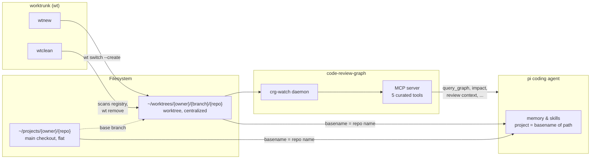
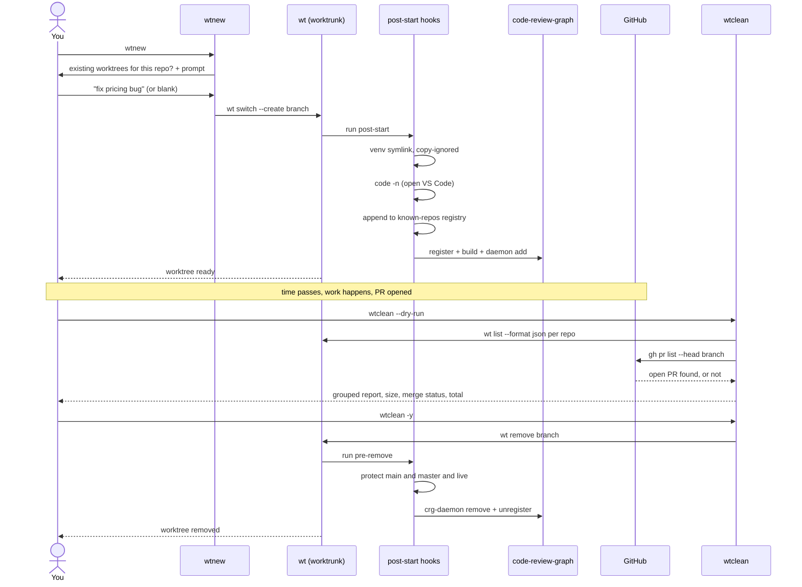
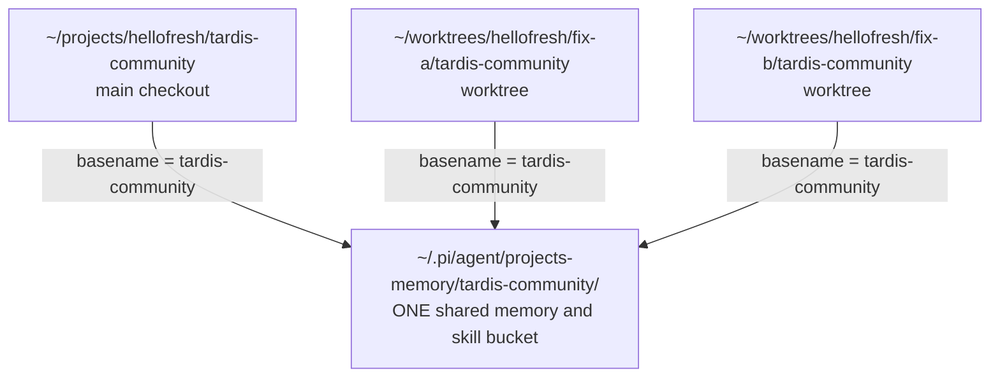

# Dev setup overview: repo layout, worktrees, code-review-graph

What changed, why, and how the pieces talk to each other. Written 2026-07-24.

## TLDR

- **Repos flattened**: `~/projects/hellofresh/<repo>` and `~/projects/personal/<repo>` — no more numbered pipeline-stage folders. Meaning/relationships now come from the code itself (code-review-graph) and TRE, not folder depth.
- **Worktrees centralized**: `~/worktrees/<owner>/<branch>/<repo>` (note: branch before repo — deliberate, see §4/diagram below, it's what keeps pi's memory and skills unified per-repo instead of fragmenting per-branch).
- **code-review-graph** indexes every repo (currently 45, growing automatically as work touches new ones), a background daemon keeps every graph fresh automatically (native FS events, no cron/hook needed), and 5 curated MCP tools are wired into pi for architecture/query/impact/review-context/change-detection questions.
- **Daily loop**: `wtnew` to start (shows what's already in flight for this repo, prompts for a short description, creates/reuses the worktree, opens VS Code, wires up code-review-graph) → work → `wtclean --dry-run` / `wtclean` to clean up (grouped by repo, shows size + merge status + a total reclaimable estimate, skips dirty/open-PR worktrees, auto-cleans stale/dangling references).
- Full evaluation history and reasoning (graphify vs codegraph vs code-review-graph, the memory-scoping bug and fix, three wtclean bugs found and fixed) is in [luiul/dotfiles#4](https://github.com/luiul/dotfiles/issues/4).

## The taxonomy problem this replaces

The old layout organized HelloFresh repos by pipeline stage: `~/projects/hellofresh/01-generation/`, `02-ingestion/`, ..., `06-governance-infra/`, plus a `misc/` catch-all. The idea was that folder structure alone would let an AI (or me) infer what a repo does.

That broke down in practice: a repo can only live in one folder, but real relationships are multi-axis (e.g. `tardis-community`, `tardis-library`, `tardis-infrastructure` are a family, but lived in three different stage folders). The scheme already needed a `misc/` escape hatch for repos that didn't fit, and when I actually needed to understand `tardis-community` mid-session, the folder name told me nothing — the README and file structure did all the work.

Decision: stop encoding meaning in folder depth. Keep the filesystem flat and dumb; let a real tool derive relationships from the actual code.

## Component roles

| Component | Job | Not its job |
|---|---|---|
| **`~/projects/<owner>/<repo>`** (flat) | Where source repos physically live | Encoding purpose/relationships via nesting |
| **worktrunk (`wt`)** | Create/switch/remove per-branch checkouts, run env-setup hooks, centralize storage | Understanding code, tracking ownership |
| **code-review-graph** | Turn every repo into a queryable, persistent code graph (SQL, Terraform, Python, Kotlin, PHP, notebooks, ...) so I don't have to re-explore from scratch each session | Team features (PR dashboards, telemetry) — deliberately skipped, this is a solo setup |
| **TRE API + each repo's own README** | Ownership (squad/tribe/alliance) + purpose truth | Duplicating either into folder names |



## 1. Repo layout: flat by owner

```
~/projects/
  hellofresh/<repo>/       <- 36 repos, flattened from 01-generation/.../06-governance-infra/misc
  personal/<repo>/         <- already flat, unchanged
```

Migration notes (for context, not something you need to redo):
- All 36 hellofresh repos moved with plain `mv` — git doesn't care about the main worktree's absolute path, so branches, uncommitted changes, and history all moved intact.
- One stale worktree reference (`isa-orchestration`, pointing at a directory a third-party tool (`supacode`) had already deleted) was unlocked and pruned first — the branch itself (`ISA-18060-remove-redundant-writeback-data-tests`) is untouched, only the dangling admin link was cleaned up.
- One stale `core.hooksPath` in `tardis-community` (pointing at a `~/projects/tardis-community` location that predates its current nested path, already dead before this move) was unset.
- `.venv/` directories were deleted, not moved, in the 4 repos that had one under `hellofresh/` (`global-ops`, `tardis-community`, `bi-opsdap-ae-automations`, `ticket-manager`) — venvs bake in absolute paths and can't be relocated; regenerate on next use (`uv sync` or equivalent). Personal repos' venvs weren't touched since they didn't move.
- 5 repos with git submodules (`limesync-onboarding`, `tardis-community`, `data-contracts-community`, `tardis-infrastructure`, `procurement-tech-ds`) verified safe beforehand — submodule gitlinks are relative (`gitdir: ../.git/modules/...`), not absolute.

## 2. Worktrees: centralized under `~/worktrees`

```
~/worktrees/<owner>/<branch>/<repo>/
```

Config: `worktree-path = "~/worktrees/{{ owner }}/{{ branch | sanitize }}/{{ repo }}"` in `~/.config/worktrunk/config.toml` (tracked in dotfiles' `worktrunk` package).

**Branch is the parent, repo is the leaf — this order is deliberate, not arbitrary.** See §4 below for why: pi's memory/skill system detects "project" from nothing more than `basename(cwd)`, so the leaf directory name has to match the repo name or every worktree becomes its own disconnected memory bucket.

Why centralized at all (vs sibling-of-repo, the worktrunk default, or nested-inside-repo):
- Sibling dirs would clutter `~/projects/hellofresh/` itself as worktrees accumulate.
- Nested-inside (`<repo>/.worktrees/`) risks polluting `git status`/tooling on shared company repos (tardis-community) unless every clone remembers a personal `.git/info/exclude` entry.
- Centralized means one place (`~/worktrees`) to eyeball everything, regardless of where the source repo lives — same reasoning as flattening `~/projects`.

### Global post-start hooks (fire once, when a worktree is *created*)

1. `venv` — symlink `.venv` from the main repo (shared across all worktrees of that repo; venvs can't be copied, only shared or rebuilt)
2. `copy` — `wt step copy-ignored --force`: reflinks every other gitignored file (dbt_packages/, .env, local config overrides) from the main repo, instant via copy-on-write
3. `vscode` — opens a new VS Code window at the worktree
4. `registry` — appends the repo path to `~/.cache/wt/known-repos`, deduped (this is what lets `wtclean` — see below — discover repos from anywhere)
5. `crg` — registers the worktree with code-review-graph, builds its graph, and adds it to the daemon's watch list (guarded by `command -v`, so this is a silent no-op on a machine without code-review-graph installed)

### Global pre-remove hooks (fire when a worktree is *removed*)

1. `protect` — refuses to remove `main`/`master`/`live`
2. `crg-cleanup` — deregisters the worktree from code-review-graph and stops its daemon watcher (always exits 0, so a code-review-graph hiccup never blocks the actual removal)

### Project-specific hook (tardis-community only)

`dbt-deps` — self-healing only: walks `pipelines/*/*/dbt/dbt_project.yml`, and for any dbt project whose `dbt_packages/` is *still* missing after `copy` ran (i.e. the base worktree never had it either), runs `dbt deps`. Scoped to this one repo via `[projects."github.com/hellofresh/tardis-community".post-start]` in the user config, so it doesn't touch any other repo, and it doesn't touch the shared repo's own `.config/wt.toml` either — this is a personal setup, not something teammates inherit.

### Zsh helpers (`~/dotfiles/zsh/.zsh_config/funcs_wt.zsh`)

- **`wtnew`** (alias `wtn`) — before prompting, shows any worktrees already open for this repo (avoids accidentally starting a near-duplicate of work already in flight elsewhere). Prompts for a short branch description (blank -> timestamp id `wip-YYYYMMDD-HHMMSS`), slugifies and caps it at 40 chars on a word boundary, then creates or reuses the worktree via `wt switch`. No Jira ticket in the branch name — that's attached when opening the PR instead, not baked into the workspace identity.
- **`wtclean`** — removes worktrees whose last commit is older than N weeks (default 2), across every repo in the registry plus the one you're standing in (or just one repo, via `--repo NAME`). Output is grouped by repo, color-coded (green = removable, yellow = skipped), and shows per-worktree size, merge status ("branch will be deleted" vs "branch will be kept"), and a total reclaimable-size estimate before you confirm. `-v/--verbose` also lists worktrees under the age threshold, for full visibility. Skips: the main worktree, the current worktree, dirty worktrees (never force-removes), and any branch with an open GitHub PR (via `gh`, with the PR title shown) — this last one matters because PRs sit open for review before merging, so age alone isn't a safe deletion signal. Also detects and cleans up *stale* worktrees (directory deleted outside of `wt` — crashed tool, manual `rm -rf`, etc.) regardless of age, since there's nothing left to lose there. Tracks and reports success/failure per removal.

## 3. code-review-graph: the semantic layer

Chosen over graphify and codegraph (both evaluated and rejected — see GitHub issue below) because:
- It's the only one of the three with real **SQL** support (tardis-community alone is ~2,800 SQL files — a dealbreaker gap in codegraph) *and* real **Terraform** support (module/variable/reference resolution — graphify's Terraform coverage is unconfirmed/generic) *and* **Jupyter/Databricks notebook** support (relevant for `platform-analytics-databricks`) — one tool instead of a two-tool split.
- Base install is 100% local and deterministic (pure tree-sitter parsing -> SQLite). Embeddings, community-detection (igraph), and LLM-based wiki generation are all opt-in extras, not installed — no token cost, no API key, nothing running that isn't free.
- Built-in multi-repo daemon, which fits a solo "many repos, many worktrees" setup natively — no custom cache-copying or merge-graph job needed, unlike what a graphify-based plan would have required.
- Ships far more MCP tools than needed (~20) — deliberately trimmed to 5 for the MCP-exposed surface (see below), keeping the *actual* interface simple even though the tool itself is broad.

### What's running right now

- **45 repos** registered and built in code-review-graph (36 hellofresh + 7 personal + dotfiles itself, plus 1 currently-active worktree registered the same way) — this count grows automatically as `wtnew`/work touches new repos, it's not a fixed number. The whole `tardis-community` monorepo (~4,000 files, ~2,800 SQL) builds in about 5 seconds.
- **`crg-watch` daemon**: one long-running process + one lightweight per-repo watcher, all idling at ~0% CPU / ~0.1% memory, using native FS events. Every registered repo's graph rebuilds automatically on save — no manual `build`/`update` step, no git-commit-hook needed.
- **`~/.cache/wt/known-repos`** (the separate registry `wtclean` scans) is lazier by design — a repo only lands there the first time `wtnew` creates a worktree for it with hooks enabled, not pre-populated for every repo you have cloned. If `wtclean` reports scanning fewer repos than you expect, that's why; it's not a bug, there's just nothing to clean up yet for a repo you've only ever worked in via its main checkout.
- **MCP server** registered in `~/.pi/agent/mcp.json`:
  ```json
  "code-review-graph": {
    "command": "code-review-graph",
    "args": ["serve", "--tools", "get_architecture_overview_tool,query_graph_tool,get_impact_radius_tool,get_review_context_tool,detect_changes_tool"],
    "lifecycle": "lazy",
    "directTools": true
  }
  ```
  Five tools exposed on purpose, out of ~20 available:
  - `get_architecture_overview_tool` — orientation: what does this repo do, what are its communities
  - `query_graph_tool` — callers/callees/imports/tests/inheritance for a specific symbol
  - `get_impact_radius_tool` — blast radius before making a change
  - `get_review_context_tool` — token-optimized context for reviewing a diff
  - `detect_changes_tool` — risk-scored change-impact analysis (read-only, doesn't re-parse)

  Every tool takes an explicit `--repo`/`repo` argument, so one server instance can answer questions about *any* registered repo — no per-repo server instances needed.

## New day-to-day workflow



**Starting work on something:**
```
cd ~/projects/hellofresh/<repo>   # or wherever you already are
wtnew                              # prompts for a description, creates the worktree,
                                    # opens VS Code, registers+builds+watches it in code-review-graph
```

**Asking me (pi) about a repo**, in the same or a different session:
- "What does `data-contracts-library` actually do?" -> `get_architecture_overview_tool`
- "What calls `resolve_pricing`?" / "What does this import?" -> `query_graph_tool`
- "What breaks if I change this file?" -> `get_impact_radius_tool`
- "Summarize this diff for review" -> `get_review_context_tool` / `detect_changes_tool`

No re-reading raw files needed for orientation questions — the graph is already there and stays fresh automatically.

**Opening a PR:** unchanged — Jira ticket and review context get attached at PR time, not baked into the branch name or the graph setup.

**Cleaning up:**
```
wtclean --dry-run           # see what's old and safe to remove, with size + merge status
wtclean                      # remove worktrees >2 weeks old, skipping dirty ones and ones with an open PR
wtclean --repo tardis-community   # scope to just one repo
wtclean -v                   # also show worktrees under the age threshold, for context
```
Removal automatically deregisters the worktree from code-review-graph too — nothing manual to remember.

**If code-review-graph or its daemon ever misbehaves:**
```
crg-daemon status              # see every watched repo/worktree + PIDs
crg-daemon logs --repo <alias> -f
crg-daemon stop / start / restart
code-review-graph repos        # list the registry
code-review-graph build        # force a full rebuild in the current repo
```
Everything here is additive and non-destructive to the actual repos — if it ever gets in the way, `crg-daemon stop` and/or removing the `code-review-graph` block from `~/.pi/agent/mcp.json` fully disables it with zero side effects on the repos themselves.

## 4. Memory/skill system compatibility (the reason branch and repo are ordered the way they are above)

**The bug.** pi's memory/skill extension (`pi-hermes-memory`) has no concept of git, git worktrees, or repos. Its entire notion of "project" is `path.basename(cwd)` at session start (`src/project.ts`), with no override hook — not a config field, not a per-call parameter, not something `/memory-switch-project` can change (that command only *lists* existing project buckets, it doesn't re-scope the active session). Project-scoped memory lives at `~/.pi/agent/projects-memory/<that basename>/`, and project-scoped skills follow the same rule.

With the original `worktree-path = ".../{{ repo }}/{{ branch }}"` template, a worktree's leaf directory was the *branch* name. That meant every worktree became its own disconnected memory/skill bucket named after the branch (`projects-memory/fix-pricing-bug/`), completely split off from everything already recorded for that repo under its main checkout (`projects-memory/tardis-community/`). Working in a worktree, I'd have zero access to prior insights/failures/conventions logged while working in the main checkout, and vice versa — for a heavy parallel-worktree workflow, that's most of the value of persistent memory gone.

**The fix.** Reordered the template so the *repo* is the leaf: `.../{{ branch }}/{{ repo }}`. Now `basename(worktree_path) == repo`, identical to the main checkout, for every worktree of that repo regardless of branch. Verified directly against the actual installed `pi-hermes-memory` code (not just reasoned about):

```
main repo                 /Users/luis.aceituno/dotfiles                                    -> project.name: dotfiles
NEW worktree (post-fix)   /Users/luis.aceituno/worktrees/luiul/memory-fix-verify/dotfiles   -> project.name: dotfiles
OLD worktree (pre-fix)    /Users/luis.aceituno/worktrees/hellofresh/tardis-community/wip-… -> project.name: wip-20260724-151503
```



Same repo, same `project.name` now, regardless of which worktree (or the main checkout) pi was launched from. Confirmed end-to-end too: a real `wt switch --create` under the new template still runs every post-start hook correctly (venv, copy-ignored, VS Code, registry, code-review-graph register+build+daemon-watch) and cleans up correctly on removal.

**What this doesn't fix, and why it's fine:** project memory is resolved *once*, when a pi session starts — not re-evaluated if you `cd` mid-session. That's an existing pi-hermes-memory design choice, unrelated to worktrees, and the right mental model already matches how you'd naturally work: `cd`/`wtnew` into the worktree first, *then* start (or resume) the pi session there, same as you'd already do for the main checkout.

**What doesn't migrate automatically:** worktrees created *before* this fix (e.g. an existing one under `.../tardis-community/wip-20260724-151503`) keep the old branch-leaf shape — git worktrees can't be safely `mv`'d the way a main checkout can (linked-worktree admin files hold absolute paths). They'll just have branch-named memory/skill scoping until removed; new worktrees created after this fix all get the corrected shape automatically.

**Side effect, mitigated:** every worktree of a repo now shares the same leaf folder name (the repo), so Finder/VS Code no longer show the branch at a glance from the folder name alone. Added `window.title` to the dotfiles-tracked VS Code settings (`git.autofetch` section) to show the active git branch in the title bar instead: `${rootName} — ${activeRepositoryBranchName} — ${activeEditorShort}`.

## Where this is tracked

Full evaluation history and reasoning — graphify vs codegraph vs code-review-graph, the memory-scoping bug and fix, the three wtclean bugs found and fixed (duplicate scans, a stale-worktree age computed from a zero timestamp, and a jq null-propagation bug that silently made every worktree look like it had an open PR) — is in [luiul/dotfiles#4](https://github.com/luiul/dotfiles/issues/4).
