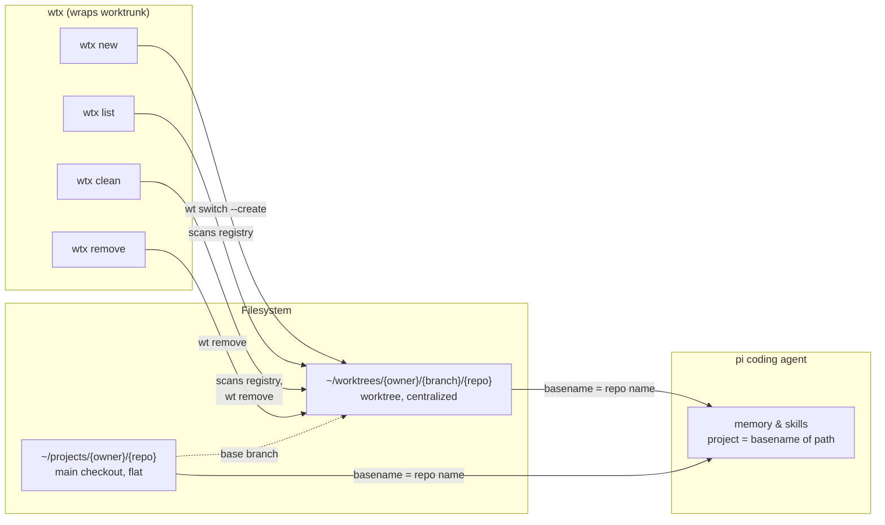
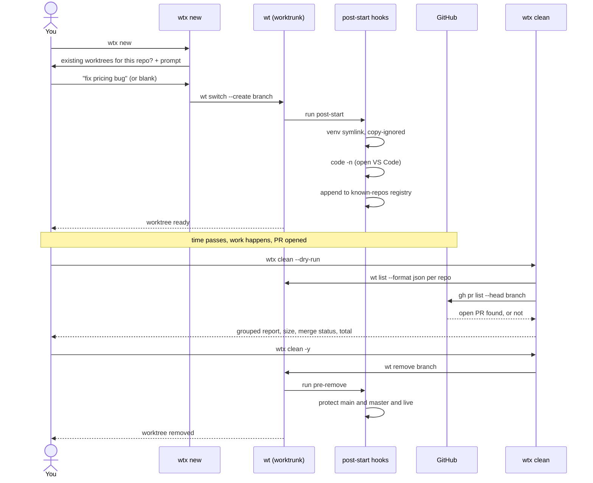
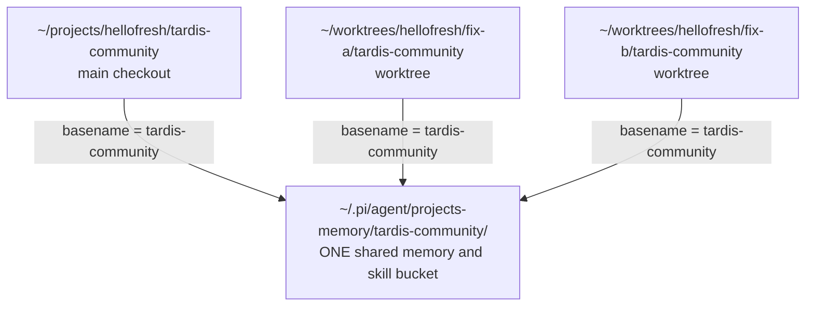

# Dev setup overview: repo layout and worktrees

What changed, why, and how the pieces talk to each other. Written 2026-07-24. Updated 2026-09-09: code-review-graph removed (never used), see "Removed: code-review-graph" at the end.

## Summary

- **Repos flattened**: `~/projects/hellofresh/<repo>` and `~/projects/personal/<repo>` — no more numbered pipeline-stage folders. Meaning/relationships come from TRE and each repo's own README, not folder depth.
- **Worktrees centralized**: `~/worktrees/<owner>/<branch>/<repo>` (note: branch before repo — deliberate, see §3/diagram below, it's what keeps pi's memory and skills unified per-repo instead of fragmenting per-branch).
- **One entrypoint, `wtx`**: `wtx new` to start (shows what's already in flight for this repo, prompts for a short description, creates/reuses the worktree, opens VS Code) → work → `wtx list` to see everything in flight across every repo → `wtx clean --dry-run` / `wtx clean` to bulk-sweep old ones (grouped by repo, shows size + merge status + a total reclaimable estimate, skips dirty/open-PR worktrees, auto-cleans stale/dangling references) or `wtx remove BRANCH` to remove one specific worktree on the spot (fzf picker if you don't already know the branch name). See §2 for why `new`/`clean`/`list`/`remove` were chosen as the subcommand names (they mirror `wt`'s own vocabulary on purpose).
- Full evaluation history and reasoning (graphify vs codegraph vs code-review-graph, the memory-scoping bug and fix, three wtclean bugs found and fixed before it became `wtx clean`) is in [luiul/dotfiles#4](https://github.com/luiul/dotfiles/issues/4).

## The taxonomy problem this replaces

The old layout organized HelloFresh repos by pipeline stage: `~/projects/hellofresh/01-generation/`, `02-ingestion/`, ..., `06-governance-infra/`, plus a `misc/` catch-all. The idea was that folder structure alone would let an AI (or me) infer what a repo does.

That broke down in practice: a repo can only live in one folder, but real relationships are multi-axis (e.g. `tardis-community`, `tardis-library`, `tardis-infrastructure` are a family, but lived in three different stage folders). The scheme already needed a `misc/` escape hatch for repos that didn't fit, and when I actually needed to understand `tardis-community` mid-session, the folder name told me nothing — the README and file structure did all the work.

Decision: stop encoding meaning in folder depth. Keep the filesystem flat and dumb; pull meaning from TRE and the repos' own READMEs instead.

## Component roles

| Component | Job | Not its job |
|---|---|---|
| **`~/projects/<owner>/<repo>`** (flat) | Where source repos physically live | Encoding purpose/relationships via nesting |
| **worktrunk (`wt`)** | Create/switch/remove per-branch checkouts, run env-setup hooks, centralize storage | Understanding code, tracking ownership |
| **TRE API + each repo's own README** | Ownership (squad/tribe/alliance) + purpose truth | Duplicating either into folder names |


```mermaid
flowchart LR
  subgraph Storage["Filesystem"]
    A["~/projects/{owner}/{repo}<br/>main checkout, flat"]
    B["~/worktrees/{owner}/{branch}/{repo}<br/>worktree, centralized"]
  end

  subgraph WT["wtx (wraps worktrunk)"]
    N["wtx new"]
    L["wtx list"]
    C["wtx clean"]
    R["wtx remove"]
  end

  subgraph PI["pi coding agent"]
    PM["memory & skills<br/>project = basename of path"]
  end

  N -->|"wt switch --create"| B
  A -.->|"base branch"| B
  B -->|"basename = repo name"| PM
  A -->|"basename = repo name"| PM
  L -->|"scans registry"| B
  C -->|"scans registry,<br/>wt remove"| B
  R -->|"wt remove"| B
```

## 1. Repo layout: flat by owner

```
~/projects/
  hellofresh/<repo>/       <- 36 repos, flattened from 01-generation/.../06-governance-infra/misc
  personal/<repo>/         <- already flat, unchanged
```

Migration notes (for context, not something you need to redo):
- All 36 hellofresh repos moved with plain `mv` — git doesn't care about the main worktree's absolute path, so branches, uncommitted changes, and history all moved intact.
- One stale worktree reference (`isa-orchestration`, pointing at a directory a third-party tool (`supacode`) had already deleted) was unlocked and pruned first — the branch itself (`ISA-18060-remove-redundant-writeback-data-tests`) is untouched, only the dangling admin link was cleaned up.
- One stale `core.hooksPath` in `tardis-community` (pointing at a `~/projects/tardis-community` location that predates its current nested path, already dead before this move) was unset.
- `.venv/` directories were deleted, not moved, in the 4 repos that had one under `hellofresh/` (`global-ops`, `tardis-community`, `bi-opsdap-ae-automations`, `ticket-manager`) — venvs bake in absolute paths and can't be relocated; regenerate on next use (`uv sync` or equivalent). Personal repos' venvs weren't touched since they didn't move.
- 5 repos with git submodules (`limesync-onboarding`, `tardis-community`, `data-contracts-community`, `tardis-infrastructure`, `procurement-tech-ds`) verified safe beforehand — submodule gitlinks are relative (`gitdir: ../.git/modules/...`), not absolute.

## 2. Worktrees: centralized under `~/worktrees`

```
~/worktrees/<owner>/<branch>/<repo>/
```

Config: `worktree-path = "~/worktrees/{{ owner }}/{{ branch | sanitize }}/{{ repo }}"` in `~/.config/worktrunk/config.toml` (tracked in dotfiles' `worktrunk` package).

**Branch is the parent, repo is the leaf — this order is deliberate, not arbitrary.** See §3 below for why: pi's memory/skill system detects "project" from nothing more than `basename(cwd)`, so the leaf directory name has to match the repo name or every worktree becomes its own disconnected memory bucket.

Why centralized at all (vs sibling-of-repo, the worktrunk default, or nested-inside-repo):
- Sibling dirs would clutter `~/projects/hellofresh/` itself as worktrees accumulate.
- Nested-inside (`<repo>/.worktrees/`) risks polluting `git status`/tooling on shared company repos (tardis-community) unless every clone remembers a personal `.git/info/exclude` entry.
- Centralized means one place (`~/worktrees`) to eyeball everything, regardless of where the source repo lives — same reasoning as flattening `~/projects`.

### Global post-start hooks (fire once, when a worktree is *created*)

1. `venv` — symlink `.venv` from the main repo (shared across all worktrees of that repo; venvs can't be copied, only shared or rebuilt)
2. `copy` — `wt step copy-ignored --force`: reflinks every other gitignored file (dbt_packages/, .env, local config overrides) from the main repo, instant via copy-on-write
3. `vscode` — opens a new VS Code window at the worktree
4. `registry` — appends the repo path to `~/.cache/wt/known-repos`, deduped (this is what lets `wtx clean`/`wtx list`/`wtx remove` — see below — discover repos from anywhere)

### Global pre-remove hooks (fire when a worktree is *removed*)

1. `protect` — refuses to remove `main`/`master`/`live`

### Project-specific hook (tardis-community only)

`dbt-deps` — self-healing only: walks `pipelines/*/*/dbt/dbt_project.yml`, and for any dbt project whose `dbt_packages/` is *still* missing after `copy` ran (i.e. the base worktree never had it either), runs `dbt deps`. Scoped to this one repo via `[projects."github.com/hellofresh/tardis-community".post-start]` in the user config, so it doesn't touch any other repo, and it doesn't touch the shared repo's own `.config/wt.toml` either — this is a personal setup, not something teammates inherit.

### `wtx`: one entrypoint for the daily loop (`~/dotfiles/zsh/.zsh_config/funcs_wt.zsh`)

Everything worktree-related is one dispatcher function, `wtx SUBCOMMAND [ARGS...]`, instead of a scattering of separate `wt*` shell functions — a single command to remember, with subcommands that mirror `wt`'s own vocabulary (`new`/`list`/`clean`/`remove`) rather than inventing new names on top of it. `wtx help` prints the full list; every subcommand also answers `--help` on its own.

- **`wtx new`** (alias `n`) — before prompting, shows any worktrees already open for this repo (avoids accidentally starting a near-duplicate of work already in flight elsewhere). Prompts for a short branch description (blank -> timestamp id `wip-YYYYMMDD-HHMMSS`), slugifies and caps it at 40 chars on a word boundary, then creates or reuses the worktree via `wt switch`. No Jira ticket in the branch name — that's attached when opening the PR instead, not baked into the workspace identity.
- **`wtx list`** (alias `ls`) — read-only, no GitHub calls, so it's always fast: shows every worktree across every repo in the registry plus the one you're standing in, grouped by repo, tagged `[main]`/`[current]`, with age and dirty/merged flags. `--repo NAME` scopes to one repo; `--json` emits the merged raw `wt list` JSON for scripting.
- **`wtx clean`** — the bulk, unattended-friendly sweep: removes worktrees whose last commit is older than N weeks (default 2), across every repo in the registry plus the one you're standing in (or just one repo, via `--repo NAME`). Output is grouped by repo, color-coded (green = removable, yellow = skipped), and shows per-worktree size, merge status ("branch will be deleted" vs "branch will be kept"), and a total reclaimable-size estimate before you confirm. `-v/--verbose` also lists worktrees under the age threshold, for full visibility. Skips: the main worktree, the current worktree, dirty worktrees (never force-removes), and any branch with an open GitHub PR (via `gh`, with the PR title shown) — this last one matters because PRs sit open for review before merging, so age alone isn't a safe deletion signal. Also detects and cleans up *stale* worktrees (directory deleted outside of `wt` — crashed tool, manual `rm -rf`, etc.) regardless of age, since there's nothing left to lose there. Tracks and reports success/failure per removal.
- **`wtx remove`** (alias `rm`) — the precise, interactive counterpart to `clean`: removes one or more specific worktrees by branch name, no age threshold, no PR check. Scope defaults to the repo you're standing in (falling back to every known repo if you're not inside one), or pass `--repo NAME` explicitly; a branch name that matches more than one known repo is treated as ambiguous and asks you to disambiguate rather than guessing. Omit the branch name entirely to get an `fzf` picker (multi-select with Tab) over the worktrees in scope; without `fzf` installed it just prints the candidates and asks you to re-run with an explicit name. Protected branches (`main`/`master`/`live`) are refused by wt's own pre-remove hook regardless.
- **`wtx status`** (alias `st`) — quick health check for the surrounding tooling: the known-repos registry that `list`/`clean`/`remove` all scan.

## New day-to-day workflow


```mermaid
sequenceDiagram
  actor You
  participant WtxNew as wtx new
  participant wt as wt (worktrunk)
  participant Hooks as post-start hooks
  participant GH as GitHub
  participant WtxClean as wtx clean

  You->>WtxNew: wtx new
  WtxNew->>You: existing worktrees for this repo? + prompt
  You->>WtxNew: "fix pricing bug" (or blank)
  WtxNew->>wt: wt switch --create branch
  wt->>Hooks: run post-start
  Hooks->>Hooks: venv symlink, copy-ignored
  Hooks->>Hooks: code -n (open VS Code)
  Hooks->>Hooks: append to known-repos registry
  wt-->>You: worktree ready

  Note over You,GH: time passes, work happens, PR opened

  You->>WtxClean: wtx clean --dry-run
  WtxClean->>wt: wt list --format json per repo
  WtxClean->>GH: gh pr list --head branch
  GH-->>WtxClean: open PR found, or not
  WtxClean-->>You: grouped report, size, merge status, total
  You->>WtxClean: wtx clean -y
  WtxClean->>wt: wt remove branch
  wt->>Hooks: run pre-remove
  Hooks->>Hooks: protect main and master and live
  wt-->>You: worktree removed
```

**Starting work on something:**
```
cd ~/projects/hellofresh/<repo>   # or wherever you already are
wtx new                            # prompts for a description, creates the worktree,
                                    # opens VS Code
```

**Opening a PR:** unchanged — Jira ticket and review context get attached at PR time, not baked into the branch name.

**Cleaning up:**
```
wtx list                          # see everything in flight, across every repo, right now
wtx clean --dry-run                # see what's old and safe to bulk-remove, with size + merge status
wtx clean                           # remove worktrees >2 weeks old, skipping dirty ones and ones with an open PR
wtx clean --repo tardis-community   # scope the bulk sweep to just one repo
wtx clean -v                        # also show worktrees under the age threshold, for context
wtx remove fix-pricing-bug          # remove one specific worktree right now, regardless of age
wtx remove                          # ...or omit the branch for an fzf picker over what's in scope
```

## 3. Memory/skill system compatibility (the reason branch and repo are ordered the way they are above)

**The bug.** pi's memory/skill extension (`pi-hermes-memory`) has no concept of git, git worktrees, or repos. Its entire notion of "project" is `path.basename(cwd)` at session start (`src/project.ts`), with no override hook — not a config field, not a per-call parameter, not something `/memory-switch-project` can change (that command only *lists* existing project buckets, it doesn't re-scope the active session). Project-scoped memory lives at `~/.pi/agent/projects-memory/<that basename>/`, and project-scoped skills follow the same rule.

With the original `worktree-path = ".../{{ repo }}/{{ branch }}"` template, a worktree's leaf directory was the *branch* name. That meant every worktree became its own disconnected memory/skill bucket named after the branch (`projects-memory/fix-pricing-bug/`), completely split off from everything already recorded for that repo under its main checkout (`projects-memory/tardis-community/`). Working in a worktree, I'd have zero access to prior insights/failures/conventions logged while working in the main checkout, and vice versa — for a heavy parallel-worktree workflow, that's most of the value of persistent memory gone.

**The fix.** Reordered the template so the *repo* is the leaf: `.../{{ branch }}/{{ repo }}`. Now `basename(worktree_path) == repo`, identical to the main checkout, for every worktree of that repo regardless of branch. Verified directly against the actual installed `pi-hermes-memory` code (not just reasoned about):

```
main repo                 /Users/luis.aceituno/dotfiles                                    -> project.name: dotfiles
NEW worktree (post-fix)   /Users/luis.aceituno/worktrees/luiul/memory-fix-verify/dotfiles   -> project.name: dotfiles
OLD worktree (pre-fix)    /Users/luis.aceituno/worktrees/hellofresh/tardis-community/wip-… -> project.name: wip-20260724-151503
```


```mermaid
flowchart TD
  M["~/.pi/agent/projects-memory/tardis-community/<br/>ONE shared memory and skill bucket"]
  R["~/projects/hellofresh/tardis-community<br/>main checkout"]
  W1["~/worktrees/hellofresh/fix-a/tardis-community<br/>worktree"]
  W2["~/worktrees/hellofresh/fix-b/tardis-community<br/>worktree"]

  R -->|"basename = tardis-community"| M
  W1 -->|"basename = tardis-community"| M
  W2 -->|"basename = tardis-community"| M
```

Same repo, same `project.name` now, regardless of which worktree (or the main checkout) pi was launched from. Confirmed end-to-end too: a real `wt switch --create` under the new template still runs every post-start hook correctly (venv, copy-ignored, VS Code, registry) and cleans up correctly on removal.

**What this doesn't fix, and why it's fine:** project memory is resolved *once*, when a pi session starts — not re-evaluated if you `cd` mid-session. That's an existing pi-hermes-memory design choice, unrelated to worktrees, and the right mental model already matches how you'd naturally work: `cd`/`wtx new` into the worktree first, *then* start (or resume) the pi session there, same as you'd already do for the main checkout.

**What doesn't migrate automatically:** worktrees created *before* this fix (e.g. an existing one under `.../tardis-community/wip-20260724-151503`) keep the old branch-leaf shape — git worktrees can't be safely `mv`'d the way a main checkout can (linked-worktree admin files hold absolute paths). They'll just have branch-named memory/skill scoping until removed; new worktrees created after this fix all get the corrected shape automatically.

**Side effect, mitigated:** every worktree of a repo now shares the same leaf folder name (the repo), so Finder/VS Code no longer show the branch at a glance from the folder name alone. Added `window.title` to the dotfiles-tracked VS Code settings (`git.autofetch` section) to show the active git branch in the title bar instead: `${rootName} — ${activeRepositoryBranchName} — ${activeEditorShort}`.

## Removed: code-review-graph (2026-09-09)

This setup originally included code-review-graph (per-repo code graphs, a `crg-watch` daemon, and 5 curated MCP tools wired into pi). Removed after a usage audit showed zero MCP tool calls across every pi session since introduction, while the tool schemas cost ~2K tokens of system prompt per session. What was removed: the `uv` tool itself, the pi `mcp.json` server block, the `crg`/`crg-cleanup` worktrunk hooks, the Brewfile entry, every repo's `.code-review-graph/` cache (~900 MB total), and the `~/.code-review-graph` registry. The wt hooks were guarded by `command -v`, so no other config needed to change. The original evaluation (graphify vs codegraph vs code-review-graph) stays in [luiul/dotfiles#4](https://github.com/luiul/dotfiles/issues/4) for history.

## Where this is tracked

Full evaluation history and reasoning — graphify vs codegraph vs code-review-graph, the memory-scoping bug and fix, the three wtclean bugs found and fixed (duplicate scans, a stale-worktree age computed from a zero timestamp, and a jq null-propagation bug that silently made every worktree look like it had an open PR) — is in [luiul/dotfiles#4](https://github.com/luiul/dotfiles/issues/4).
