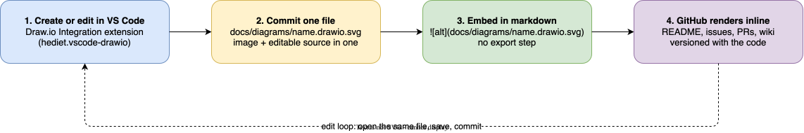

# Diagrams in READMEs and VS Code

Convention for sharing draw.io diagrams in GitHub markdown. One format, one location,
one editor. Written 2026-09-10.

## The standard

- One file per diagram: `docs/diagrams/<name>.drawio.svg` (kebab-case name).
- A `.drawio.svg` is a valid SVG with the draw.io XML source embedded inside the file.
  GitHub renders it as an image. The VS Code extension re-opens it as an editable
  diagram. No export step, and no separate `.png` that drifts out of sync with its
  source.
- Embed it with a normal markdown image reference:

  ```markdown
  
  ```

- Never paste raw draw.io XML or Mermaid source fences into markdown. Rendered images
  only, with the editable source embedded or kept alongside.

## Tooling (already installed via this repo)

| Tool | Where it comes from |
| --- | --- |
| draw.io desktop app (provides the `drawio` CLI) | `cask "drawio"` in `brew/Brewfile` |
| Draw.io Integration for VS Code (`hediet.vscode-drawio`) | `vscode "hediet.vscode-drawio"` in `brew/Brewfile`, recommended in `vscode/.../extensions.json` |
| Editor appearance follows the VS Code theme | `hediet.vscode-drawio.appearance: "automatic"` in `vscode/.../settings.json` |

The VS Code extension works offline by default (`hediet.vscode-drawio.offline: true`),
so no network account or login is involved.

## Create a diagram

In VS Code (the default path):

1. Create an empty file named `docs/diagrams/<name>.drawio.svg`.
2. Open it. The extension opens the draw.io editor in the editor pane.
3. Draw, save, commit. Done.

Via the CLI (for scripting or bulk work):

```sh
drawio -x -f svg -e -o docs/diagrams/<name>.drawio.svg <name>.drawio
```

The `-e` (`--embed-diagram`) flag is what embeds the XML source. Without it the SVG is
a plain image and cannot be re-opened as a diagram. The export embeds fonts by default,
which adds most of the file size; pass `--embed-svg-fonts false` to shrink the file at
the cost of less exact text rendering on machines without the font.

## Edit a diagram

- **VS Code (primary):** open the file, edit, save, commit. GitHub renders the new
  version on the next page load.
- **VS Code, convert formats:** the `Draw.io: Convert To...` command converts between
  `.drawio`, `.drawio.svg`, and `.drawio.png`.
- **Browser (fallback, no VS Code):** open app.diagrams.net with the raw GitHub URL as
  a URL parameter:

  ```
  https://app.diagrams.net/#U<url-encoded raw.githubusercontent.com URL>
  ```

  Example: `https://app.diagrams.net/#Uhttps%3A%2F%2Fraw.githubusercontent.com%2Fluiul%2Fdotfiles%2Fmain%2Fdocs%2Fdiagrams%2Fdrawio-sharing-flow.drawio.svg`.
  Saving back to the repo from the browser needs the GitHub storage mode with OAuth.
  Treat the browser as a viewer and ad hoc editor; VS Code stays the primary path.

## Rules

- Check the rendered diagram in GitHub light **and** dark mode before merging. Prefer
  explicit fill colors with enough contrast over transparent diagrams with dark text.
- One diagram per file. Keep it small and single-purpose.
- Prefer SVG. Use `.drawio.png` (same idea, XML embedded in a PNG) only when the target
  context cannot display SVG.
- Migrate old `name.png` + `name.drawio` pairs: open the `.drawio` in VS Code, run
  `Draw.io: Convert To...` -> `.drawio.svg`, update the markdown reference, delete the
  old pair.
- Repo-local variant of this convention: if a repo has no `docs/` directory, put the
  `diagrams/` directory next to the README that uses it.

## Fallback: two-file export flow

When the single-file format does not fit (for example a Marp deck that needs a plain
PNG), keep the source next to the rendered image and re-render with the CLI:

```sh
drawio -x -f png -t -s 2 -o diagrams/<name>.png diagrams/<name>.drawio
```

Mermaid sources (`.mmd`) work as input too. The CLI pitfalls (hangs on certain dotted
edge labels, Mermaid quirks, verification steps) are documented in the pi skill
`export-drawio-diagrams-as-images-via-cli`.

## What not to use

- The self-editing SVG / `edit-diagram.html` flow from the drawio GitHub docs. It needs
  hosted HTML plus credentials in URL parameters. The VS Code flow covers editing with
  less machinery.
- The `drawio` / `excalidraw` MCP tools in pi. They render an interactive view inside
  the chat only and write no file to disk. For an image file, use the `drawio` CLI.

## Example

The diagram below is itself a `.drawio.svg` committed at
`docs/diagrams/drawio-sharing-flow.drawio.svg`. Open that file in VS Code to edit it,
or use it to test the flow end to end.



Round-trip check (proves the SVG still opens as a diagram, same thing the extension
does when you open the file):

```sh
drawio -x -f png -o /tmp/check.png docs/diagrams/drawio-sharing-flow.drawio.svg
```
