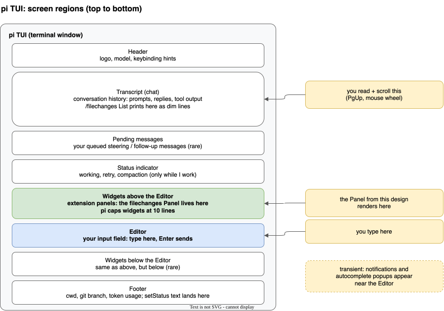
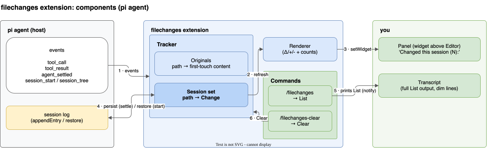
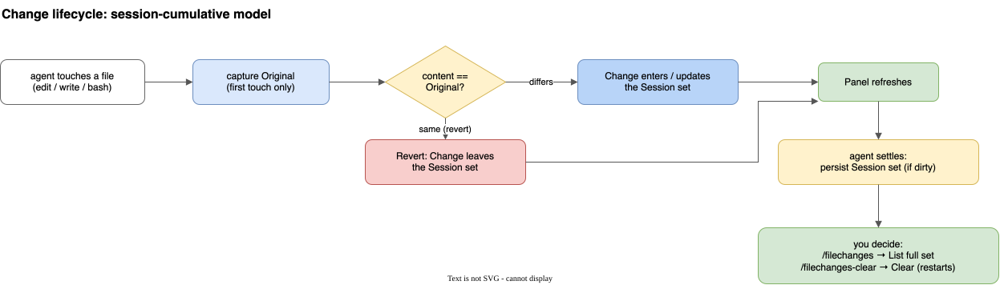

# filechanges extension: design and vocabulary

Status: implemented in `pi/.pi/agent/extensions/filechanges.ts` (https://github.com/luiul/dotfiles/issues/25).

## Purpose

- Track which files the agent changed in this session.
- Show them in a persistent Panel above the Editor.
- Print the full list on demand.
- Clear the list manually.

## Scope: the session, not the repo

- The scope is the pi session. Not the current directory. Not the git repo.
- `edit` and `write` tool calls are tracked at any path, inside or outside the repo.
- `bash` changes are detected only inside a git repo (by diffing `git status` before and after each call). Bash changes outside a repo are not detected. Known limit.
- Counts are measured against the file's Original (first touch this session), not against git HEAD. If a file was already dirty before the session, only what the agent changed is counted.
- Paths outside the current directory are shown as absolute paths.

## How you and I talk: the pi TUI

The TUI is a stack of regions. These are pi's own names, read from its source. This design touches two of them: the Panel renders in the widget area above the Editor, and List output lands in the Transcript.



| pi name | What it is | How this design uses it |
| --- | --- | --- |
| Editor | The input field where you type. Enter sends. | You run `/filechanges` and `/filechanges-clear` from here. |
| widget, placement `aboveEditor` | Persistent content region above the Editor, via `ctx.ui.setWidget()`. pi truncates widgets past 10 lines. | The Panel renders here. |
| Transcript (`chatContainer`) | The scrollable conversation: prompts, replies, tool output. `ctx.ui.notify(text, "info")` appends dim text lines here. | List output lands here and stays visible. |
| Footer | Bottom bar: cwd, git branch, token usage. `ctx.ui.setStatus()` text lands here. | Not used. The old design had a status line here; it was removed. |
| Status indicator | Working, retry, compaction row, only while the agent works. | Not extension controlled. |

## Components



Flow, matching the numbered edges:

1. pi events (`tool_call`, `tool_result`, `agent_settled`, `session_start` / `session_tree`) drive the Tracker.
2. The Session set feeds the Renderer on every change.
3. The Renderer updates the Panel via `setWidget`.
4. On `agent_settled` the Session set is persisted to the session log (only when dirty). On session start it is restored.
5. `/filechanges` prints the full Session set into the Transcript.
6. `/filechanges-clear` empties the Tracker (Session set and Originals).

## Vocabulary

One name per concept. These names will be used verbatim in code, comments, and command descriptions.

| Term | Meaning | Replaces in code |
| --- | --- | --- |
| Original | File content captured the first time a file is touched this session. The reference for counts and revert detection. | `baseline` |
| Change | One file whose current content differs from its Original. Has a path, a kind, and counts. | `BatchEntry` |
| Kind | `created`, `modified`, or `deleted`. Derived from Original vs. current (missing on one side). | `kind` (stays) |
| Counts | `+added/-removed` lines vs. the Original, or `(binary)`. | `added` / `removed` (stay) |
| Session set | The cumulative collection of Changes since session start or the last Clear. Never resets on its own. | `batch` |
| Revert | A Change whose content equals its Original again. It leaves the Session set automatically. | (no name today) |
| Tracking | Recording Changes: snapshots on `tool_call`, commit on `tool_result`, git diffing for bash. | `recordChange` → `trackChange` |
| Panel | The persistent widget above the Editor. Live view of the Session set, capped at 8 rows. | `widget` / `buildWidgetLines` |
| List | `/filechanges`. Prints the full Session set into the Transcript. | `printSummary` |
| Clear | `/filechanges-clear`. Empties the Session set, forgets all Originals. Tracking restarts from that point. | (stays) |
| Persist | Saving the Session set into the session log so the Panel survives `/reload`. | `persistBatch` / `ENTRY_BATCH` |

Two terms disappear on purpose: batch (the old reset per prompt unit) and summary (the deleted notification).

## Lifecycle



- The Original is captured once, at first touch. Later touches of the same file compare against it.
- The compare happens after every tool result, so the Panel is always live.
- Revert is automatic. It needs no user action and no extra state.
- Persist runs at settle time, only when something changed since the last settle (the `dirty` flag).

## Panel rendering spec

```text
Session changes (3):
modified pi/.pi/agent/AGENTS.md (+1/-1)
created  notes.md (+12/-0)
deleted  old.ts (+0/-40)
…and 2 more (see /filechanges)
```

- Header: `Session changes (N):` where N is the Session set size.
- One plain word per kind: `modified`, `created`, `deleted` (padded to a column). No glyphs, matching the status-bar style (`changed 3`, `ahead 2`). The same words are used in List output. One rendering style everywhere.
- Counts always show both sides, even when one is zero. Uniform, no special cases.
- Binary files show `(binary)` instead of counts.
- Rows are sorted by most recently touched first.
- Cap of 8 rows, then an overflow line pointing to `/filechanges`. Header plus 8 rows plus overflow line is 10 lines, exactly pi's widget limit.
- Empty Session set: the Panel is hidden.
- Colors come from the pi theme: counts in success/error, the rest muted. Opaque enough for light and dark mode.

## Commands

| Command | Effect |
| --- | --- |
| `/filechanges` | Prints the full Session set into the Transcript as dim lines (up to 30 rows, then an overflow note). |
| `/filechanges-clear` | Empties the Session set and forgets all Originals. The Panel hides. Tracking continues; the next change starts a fresh accumulation from that point. |

## Edge cases

- Revert: a file changed back to its Original drops off the list by itself (content compare, not line counting).
- `/reload` or resumed session: the Session set is restored from the log. In a git repo, Originals are re-captured from `git show HEAD:<path>` so later edits keep sensible counts. Outside a repo, restored counts stay frozen as recorded.
- Binary files: NUL byte sniff in the first 8000 bytes.
- Ignored paths: `filechanges.ignore` in `.pi/settings.json` (project wins over global). Defaults cover lockfiles, `node_modules`, `dist`, `build`, `.env*`.
- Bash outside a git repo: not detected (see Scope).

## What gets removed from the current implementation

- The settle time notification (the `Files changed (2): — total +2/-1` block). The Panel replaces it.
- The footer status line (`last batch: Δ1 +1 (+2/-1)`).
- The batch lifecycle: `awaitingFreshBatch`, clearing on the first change of a new prompt. The Session set just accumulates.
- The `new` / `edited` kind names in code. The kinds are `created` / `modified` / `deleted`, shown as plain words (see open question 3).
- Net effect: about a third of the file goes away.

## Open questions (resolved)

1. Header wording: resolved to the shorter `Session changes (N):`.
2. Clear semantics: accepted. After a Clear, counts for a file edited again are measured from the post Clear state, not from session start.
3. Kind marker: no glyphs. Plain words (`modified` / `created` / `deleted`), matching the statusline in the footer.
